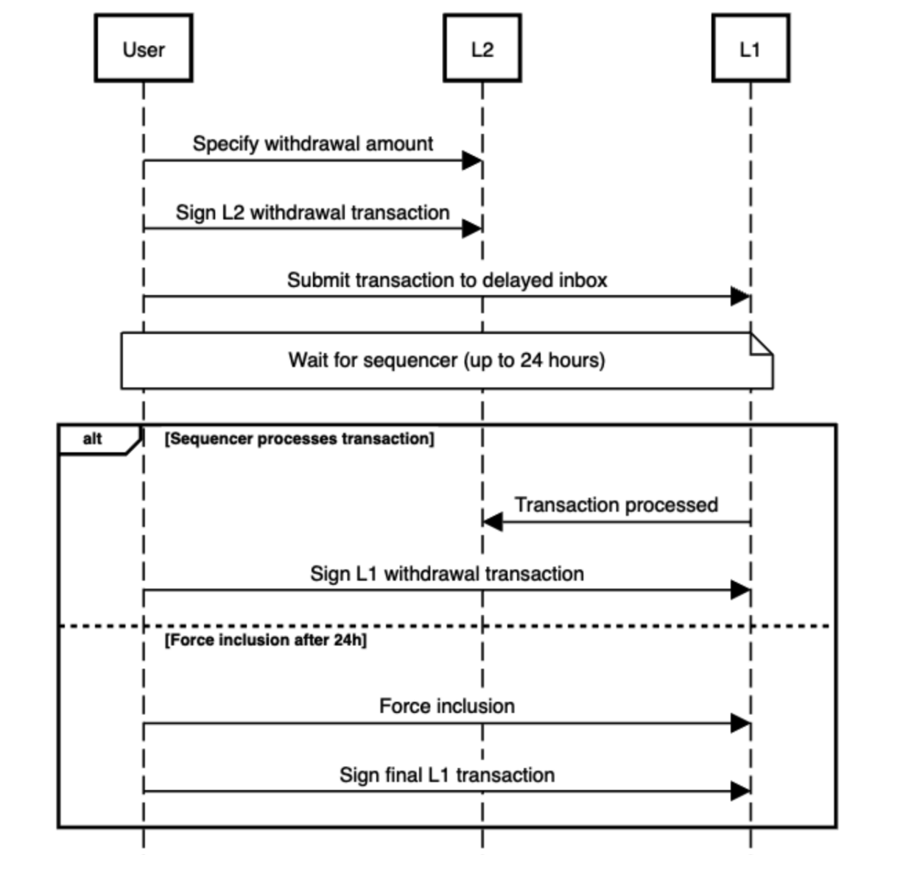

# 🧰 Arbitrum Transaction Enforcer - WakeUp Labs

Welcome to [WakeUp Labs](https://www.wakeuplabs.io/) implementation of the front-end interface that enables users to force-include that we proposed here: [Tally](https://forum.arbitrum.foundation/t/tally-front-end-interface-to-force-transaction-inclusion-during-sequencer-downtime/21247).

You can take a look to the follow up or the project in the [Arbitrum Forum](https://forum.arbitrum.foundation/t/wakeup-labs-update-thread-front-end-interface-to-force-transaction-inclusion-during-sequencer-downtime/25926).

We have developed a web app designed to facilitate an uncommon type
of withdrawal that bypasses the Arbitrum sequencer, enabling users to transfer funds from the
Arbitrum network (Layer 2) to the Ethereum network (Layer 1). This web app demonstrates the
feasibility and functionality of these specialized cross-chain fund transfers, ensuring a seamless
and secure user experience.

This project aims to foster the decentralization of the Arbitrum chain by avoiding dependence on
a centralized single point of failure in cases where the Sequencer may not function
correctly —something currently achievable only by highly technical users—.

## Introduction

We developed a system that leverages Arbitrum's design to bypass the sequencer. Utilizing the
[Arbitrum SDK](https://github.com/OffchainLabs/arbitrum-sdk), we directly place user transactions into the delayed inbox on Layer 1 (L1). Once
a transaction is submitted, we must wait for the sequencer's required 24-hour window to
gracefully include the transaction. If the sequencer fails to do so within this time-frame, we use
the SDK to force the inclusion of the transaction.

The implementation is fully open source with MIT license.

## How to run

### Local Setup Guide

TL;DR

#### Required Prerequisites

- Node version: 18.18.2
- npm version: 9.8.1

Also, Node 18.18.2 comes with npm 9.8.1, so the project should work properly with it. In any case, npm workspaces were added in npm 7.0.0, so you should have at least that version (9.8.1 strongly recommended).

#### Steps to Run Locally

1.  Clone the repository:

    ```bash
     git clone https://github.com/wakeuplabs-io/arbitrum-transaction-enforcer.git
    ```

2.  Install dependencies:

    ```bash
     npm install
    ```

3.  Start the local server:

    ```bash
     npm run dev
    ```

## Process Flow

The Arbitrum Sdk supports all types of transactions, but our user interface (UI) is currently
limited to handling withdrawals, the most popular and important use case. Here's a diagram of the withdrawal process:



> You can read more about the technical specifications [here](https://drive.google.com/file/d/1mBZLs-64t7PxTXpgJsqTmKRwsR5w5opG/view).

## Try It Out - Quick Demo

Sometimes, examples speak louder than words.

Here is the first implementation of the web app.
The core objective is to provide a user-friendly interface that guides users through the step-by-step process of withdrawing funds from the L2 (Arbitrum) to the L1 (Ethereum) network.

Try it out here: https://staging-transaction-enforcer.wakeuplabs.link/


---

<div style='text-align: center;'>
  <a href='https://www.wakeuplabs.io/' target='_blank' rel='noreferrer'>
    Made with love ❤️ by WakeUp Labs
  </a>
</div>
