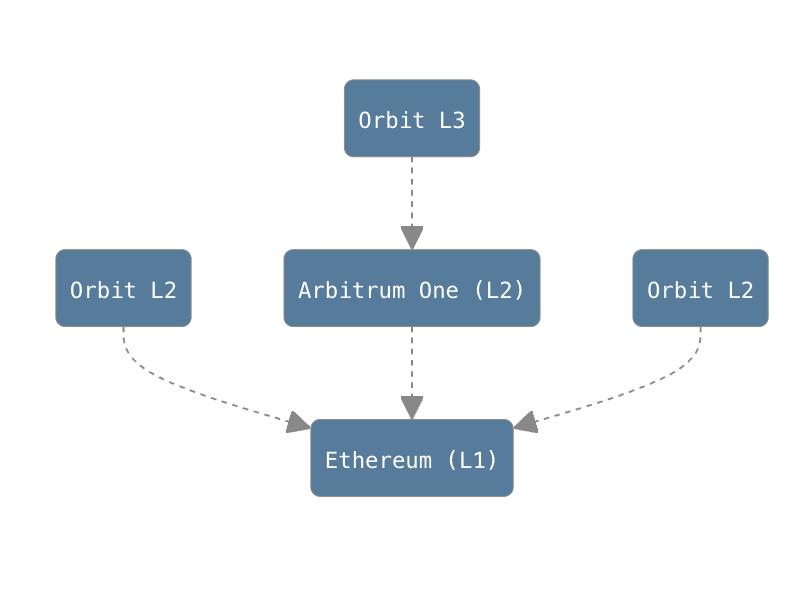
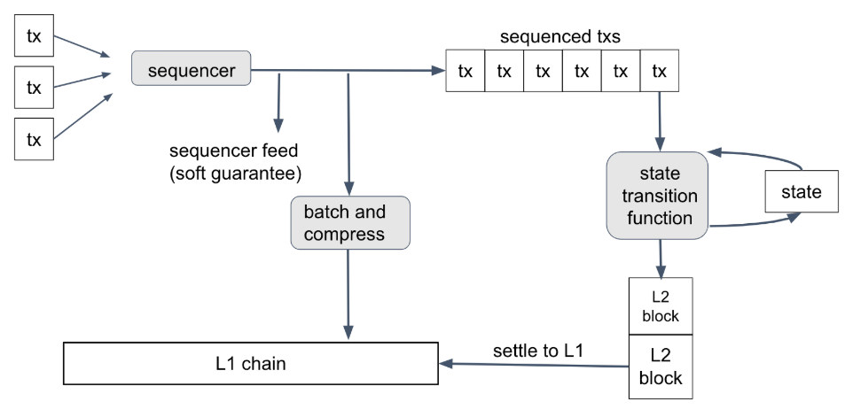
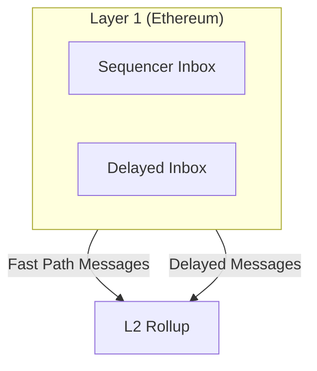
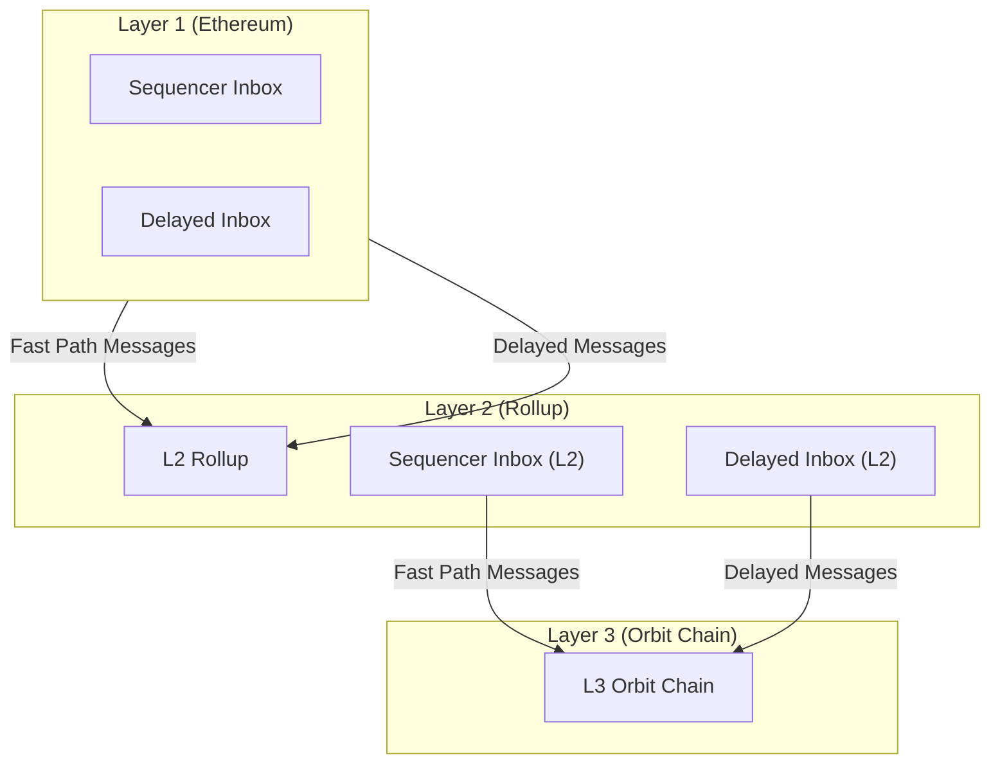
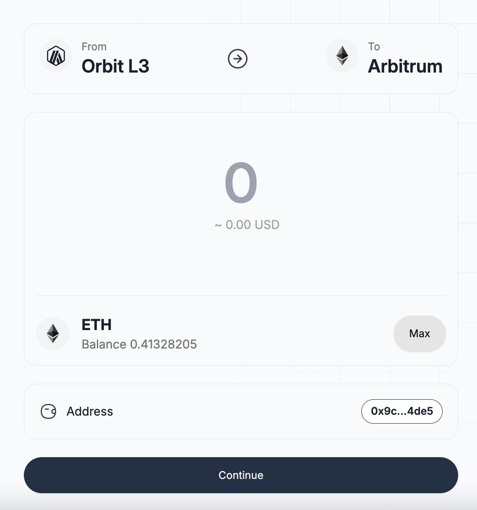
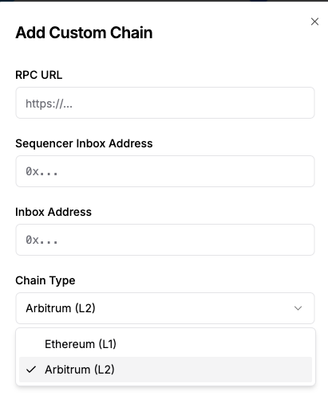
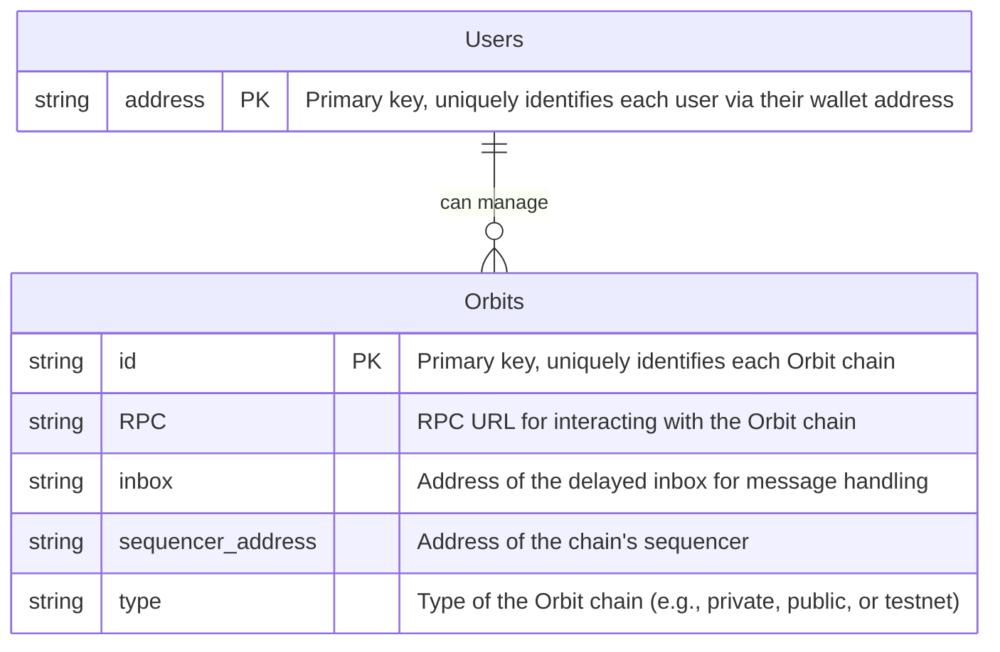

# Research Plan: Force-Inclusion Mechanism for Orbit Chains

[Original Proposal Link](https://forum.arbitrum.foundation/t/tally-front-end-interface-to-force-transaction-inclusion-during-sequencer-downtime/21247)

## **Objective**
To design and implement a robust open-source front-end interface enabling transaction force-inclusion during sequencer downtime for Orbit Chains. This includes researching delayed inbox mechanisms and integrating the solution into the broader Orbit ecosystem.

---

## **Scope**
1. Analyze the **Orbit Chain stack** to understand existing infrastructure and limitations.
2. Research mechanisms for **Force-Inclusion** during sequencer downtime.
4. Produce public-facing documentation for technical insights and implementation guidance.
5. Build a collaborative framework with Arbitrum DAO and ecosystem partners.

---

## **Glossary**

1. **Sequencer:** In blockchain networks like Arbitrum, a sequencer is responsible for ordering transactions and ensuring they are processed correctly. It helps maintain the sequence and integrity of transactions on the network.
2. **Cross-chain transfers:** These are transactions that move assets or data between
different blockchain networks. For example, transferring funds from an Ethereum Layer 2 network to the Ethereum Layer 1 network.
3. **Arbitrum SDK:** A software development kit (SDK) provided by Arbitrum, designed to facilitate the creation and management of applications on the Arbitrum blockchain, including tools for interacting with smart contracts and handling transactions.
4. **Delayed Inbox Functionality:** Provides a mechanism for handling transaction delays during downtime. Users can submit transactions directly to L1 for forced inclusion, mitigating the risks of sequencer outages or censorship.
5. **Outbox System:** Validates L2-to-L1 messages through Merkle proofs and manages the execution of these messages on L1, ensuring consistency with Arbitrum’s rollup design.
6. **Arbitrum One** implements the Rollup protocol, which stores raw transaction data on Ethereum L1, while **Arbitrum Nova** implements the AnyTrust protocol, which uses a data availability committee (DAC) to store raw transaction data, expediting settlement and reducing costs by introducing a security assumption.

---
## State of the art

The project builds on the foundational work of Arbitrum's Delayed Inbox and Outbox systems, leveraging their mechanisms to handle L2-to-L1 messaging during sequencer downtime or failures. These systems play a vital role in ensuring the resilience of Arbitrum Rollups by enabling the secure and reliable inclusion of L2 transactions on L1.

The [previous initiative](https://forum.arbitrum.foundation/t/tally-front-end-interface-to-force-transaction-inclusion-during-sequencer-downtime/21247) focused on bypassing the sequencer to enable transaction submission from Arbitrum to Ethereum.

The current project aims to extend this capability to Orbit Chains, broadening the scope of decentralized and resilient transaction handling across the Arbitrum ecosystem. To achieve this, it is crucial to thoroughly analyze the architecture and operational mechanics of Orbit Chains, identify potential limitations, and address any challenges that may arise during implementation.

## From Arbitrum to L1 solution

To implement the transaction execution, we use the [arbitrum-sdk](https://github.com/OffchainLabs/arbitrum-sdk).

```
import { ethers } from 'ethers'
import { getArbitrumNetwork } from '@arbitrum/sdk/dist/lib/dataEntities/networks'
import { InboxTools } from '@arbitrum/sdk'

export class ArbitrumDelayedInbox {
    constructor(private readonly childChainId: number) {}

    async assembleChildTransaction(l2Signer: ethers.Signer, tx: any) {
        const l2Network = await getArbitrumNetwork(this.childChainId)
        const inboxSdk = new InboxTools(l2Signer, l2Network)
    
        return await inboxSdk.assembleChildTx(tx, l2Signer)
    }

    async signChildTransaction(l2Signer: ethers.Signer, tx: any): Promise<string> {
        const l2Network = await getArbitrumNetwork(this.childChainId)
        const inboxSdk = new InboxTools(l2Signer, l2Network)
    
        const l2SignedTx = await inboxSdk.signChildTx(tx, l2Signer)
        const l2TxHash = ethers.utils.parseTransaction(l2SignedTx).hash 
        if (!l2TxHash) {
            throw new Error("Error signing child transaction")
        }
        return l2TxHash
    }

    async sendChildTransaction(l2Signer: ethers.Signer, tx: any): Promise<string> {
        const l2Network = await getArbitrumNetwork(this.childChainId)
        const inboxSdk = new InboxTools(l2Signer, l2Network)
    
        const l2SignedTx = await inboxSdk.sendChildTx(tx, l2Signer)
        const l2TxHash = ethers.utils.parseTransaction(l2SignedTx).hash 
        if (!l2TxHash) {
            throw new Error("Error signing child transaction")
        }
        return l2TxHash
    }

    async sendChildTransactionToParent(l1Signer: ethers.Signer, l2SignedTx: string): Promise<string> {
        const l2Network = await getArbitrumNetwork(this.childChainId)
        const inboxSdk = new InboxTools(l1Signer, l2Network)

        const resultsL1 = await inboxSdk.sendChildSignedTx(l2SignedTx)
        if (resultsL1 == null) {
            throw new Error(`Failed to send tx to l1 delayed inbox!`)
        }
        return resultsL1.hash;
    }

    async canForceInclude(l1Signer: ethers.Signer) {
        const l2Network = getArbitrumNetwork(this.childChainId);
        const inboxSdk = new InboxTools(l1Signer, l2Network);
    
        return !!(await inboxSdk.getForceIncludableEvent());
    }

    async forceInclude(l1Signer: ethers.Signer): Promise<ethers.ContractReceipt | null> {
        const l2Network = getArbitrumNetwork(this.childChainId);
        const inboxTools = new InboxTools(l1Signer, l2Network);
    
        const forceInclusionTx = await inboxTools.forceInclude();
    
        if (forceInclusionTx) {
            return await forceInclusionTx.wait();
        } else return null;
    }
}
```

The core of the solution lies in establishing communication with the Delayed Inbox. The primary objective at this stage is to develop a comprehensive plan and identify potential limitations within the implementation of Orbit Chains.


### Process flow

The Arbitrum Sdk supports all types of transactions, but our user interface (UI) is currently
limited to handling withdrawals, the most popular and important use case. Here's a step-by-step breakdown of the withdrawal process:

1. **Initiation:** Users specify the amount they wish to withdraw and sign the Layer 2 (L2)
withdrawal transaction.
    - We use the SDK's InboxTools signChildTx function to minimize complexity.
    
2. **Submission to Delayed Inbox:** To account for potential sequencer failures or user
bans, our system immediately submits the transaction to the Delayed Inbox. The user
signs a second transaction on L1 to post the initial transaction.
    - We use the SDK's InboxTools sendChildSignedTx function which executes the contract *Inbox.sol:SendL2Message* function.
    
3. **Waiting Period:** The system waits for the sequencer to process the transaction. If the sequencer resumes normal operations, the transaction is processed, and the user can claim the funds to complete the withdrawal.
    - Validation consists of a local check for elapsed 24 hours plus the SDK’s InboxTools getForceIncludableEvent function which relies on two contracts: *SequencerInbox.sol:totalDelayedMessagesRead* function and
*Bridge.sol:delayedInboxAccs* function.

4. **Forced Inclusion:** If the sequencer does not process the transaction within ~24 hours, the user signs a final transaction on L1 to force the inclusion of the initial transaction, allowing for the subsequent withdrawal.
    - Execution is achieved through the SDK's InboxTools forceInclude function which executes the contract SequencerInbox.sol:forceInclusion function.

5. **Funds Claim:** Regardless of the transaction being included by the sequencer or forced, the user can claim its funds through our UI (or through the bridge).


## Orbit Chains

Arbitrum Orbit is a new product offering that lets everyone creates its own customizable L2 or L3 chain.

Orbit Chains can be a Layer 2 (L2) chain which settles directly to Ethereum, or a Layer 3 (L3) chain which can settle to any Ethereum L2, such as Arbitrum One.



The problem can be separated into two big categories: Orbit L2 and L3. In both cases, we should follow this steps:

```javascript
// Pseudocode
signChildTx();         // Sign the child transaction
sendChildSignedTx();   // Send the signed child transaction
forceInclusion();      // Force inclusion of the transaction
```


Every Orbit chain can be configured to be either a Rollup or AnyTrust Chain. They are powered by self-managed nodes running their own instance of Arbitrum Nitro's node software. This software implements both AnyTrust and Rollup protocols; your Orbit chain can be configured to use either. 

As we can can think of Orbit chains as deployable, configurable instances of the Arbitrum Nitro tech stack, all of them will have the same architecture.



### Orbit L2

#### Architecture



- The Sequencer Inbox and Delayed Inbox are deployed on L1 (Ethereum).
Orbit Chain L2 Rollup interacts with these contracts to process messages:
    - Fast Path Messages via the Sequencer Inbox.
    - Delayed Messages via the Delayed Inbox.

#### Limitations

One potential limitation lies in the Arbitrum SDK, as it was primarily designed for use with the main Arbitrum chains. However, this is not a significant issue because each Orbit chain will have its own Sequencer and Delayed Inbox. Instead of relying solely on the SDK, we can directly interact with the relevant smart contracts, ensuring compatibility and functionality for custom Orbit deployments.


#### Proof of concept

To illustrate the concept, we can use Arbitrum One as a proof of concept (PoC). It's important to note that Arbitrum One serves as an example of a rollup chain, while Arbitrum Nova represents an AnyTrust chain.

For our purposes, we focus on two critical components: the Sequencer Inbox and the Delayed Inbox. These contracts are present in all three example rollups mentioned: Arbitrum One, Arbitrum Nova, and Arbitrum Sepolia.

| Contract            | Arbitrum One       | Arbitrum Nova      | Arbitrum Sepolia   |
|---------------------|--------------------|--------------------|--------------------|
| Sequencer Inbox    | [0x1c47...82B6](https://etherscan.io/address/0x1c479675ad559DC151F6Ec7ed3FbF8ceE79582B6)      | [0x211E...c21b](https://etherscan.io/address/0x211E1c4c7f1bF5351Ac850Ed10FD68CFfCF6c21b)      | [0x6c97...be0D](https://sepolia.etherscan.io/address/0x6c97864CE4bEf387dE0b3310A44230f7E3F1be0D)      |
| Delayed Inbox      | [0x4Dbd...AB3f](https://etherscan.io/address/0x4Dbd4fc535Ac27206064B68FfCf827b0A60BAB3f)      | [0xc444...3949](https://etherscan.io/address/0xc4448b71118c9071Bcb9734A0EAc55D18A153949)      | [0xaAe2...ae21](https://sepolia.etherscan.io/address/0xaAe29B0366299461418F5324a79Afc425BE5ae21)      |

Since each implementation includes both the Sequencer Inbox and the Delayed Inbox, we can replicate the steps already mentioned.

This process demonstrates how we can leverage the sequencer and delayed inbox for transaction handling and force-inclusion mechanisms in others L2 Orbit chains.

### Orbit L3

#### Proof of Concept

As a proof of concept, we deployed a rollup over Arbitrum. This resulted in the deployment of the following smart contracts:

```jsonld
{
  "networkFeeReceiver": "0x9c28de87e236461DCe72d12e9d922EEa31284de5",
  "infrastructureFeeCollector": "0x9c28de87e236461DCe72d12e9d922EEa31284de5",
  "staker": "0x5cFb3b787B1BD5547D13cf62656c04C883317c50",
  "batchPoster": "0xA52078d1FEa0783900A72D0E3DEACDdbe535B623",
  "chainOwner": "0x9c28de87e236461DCe72d12e9d922EEa31284de5",
  "chainId": 24802239149,
  "chainName": "My Arbitrum L3 Chain",
  "minL2BaseFee": 100000000,
  "parentChainId": 421614,
  "parent-chain-node-url": "https://sepolia-rollup.arbitrum.io/rpc",
  "utils": "0x7C100c97a54e2D309a194752Df2f66922A802be3",
  "rollup": "0x7A08988fF97D55Cde8AFF6964A21eF29886777A1",
  "inbox": "0x5f8FA47BdB016916AE9134B155A86442410645c6",
  "nativeToken": "0x0000000000000000000000000000000000000000",
  "outbox": "0x044b686C13966729B20B558710ee8f99EFF93e60",
  "rollupEventInbox": "0x24e4F39Cb027b6470EA17b879cB3b1543ebD1f7C",
  "challengeManager": "0xF7c0b7741Ad71d68e33FC2F12Fb981D7fceFE8bb",
  "adminProxy": "0xe847708D16B8F34aD2595422414E3C0eD2Bd5f81",
  "sequencerInbox": "0x1fd74A0204724AEbF2507c37e156619B7cC95687",
  "bridge": "0x9079816621B094389C940acb382331d5A3b6424F",
  "upgradeExecutor": "0xe87c871e03E4fc9FCE2906c6f06321AFBaf2057C",
  "validatorUtils": "0x7C100c97a54e2D309a194752Df2f66922A802be3",
  "validatorWalletCreator": "0xFAd2C6Cb969Ab7B18d78BD63e512b650bb70B570",
  "deployedAtBlockNumber": 101101355
}
```
For this implementation, the Sequencer Inbox and Inbox addresses are particularly important as they handle fast-path and delayed message flows.

#### Architecture

The architecture for the Orbit L3 setup involves a multi-layer design, as shown below:



For this case, we are focusing solely on L3-to-L2 communication.

## Wire frames and implementation

This implementation builds upon the existing version, extending it to support Orbit chains. The primary focus is on enabling transactions to be forced from an L3 Orbit Chain to Arbitrum (L2).

1. **Chains selectors**
    a. **From Label (L3 Source Selection)**
        - The "From" field should present a list of well-known Orbit chains along with a custom option.
        - **Important Note:** L3 Orbit Chains can only communicate directly with L2 (Arbitrum), not with L1.

    b. **To Label (L1 or L2 Source Selection)**
        - The "To" field should present a list of well-known chains: Arbitrum or Ethereum.
        **Important Note:** 
            - L3 Orbit Chains can only communicate directly with L2 not with L1.
            - L2 Orbit Chains can only communicate directly with L1 (Ethereum)

 **Example wireframe:**



3. **Custom Orbit Chain Option**

    - To accommodate custom solutions, users should have the ability to add their own Orbit chains. This information could be stored in a centralized database.
    - While the final design will undergo a proper UI/UX process, a preliminary concept for the UI might resemble the following image:



The proposed database schema is designed to support a decentralized application (dApp) that allows users, identified by their wallet addresses, to add and manage custom Orbit Chains. When users connect their wallets to the application, their personalized Orbit Chains are listed and made available within the app.

The method of storing this data will be determined during development. Options include local storage for simplicity or a database for a more robust and scalable solution. The final choice will depend on the specific constraints of the project in the development stage, ensuring flexibility and a user-friendly experience.

Below is the initial draft of the database schema, represented in Mermaid:



4. **Completion of Steps**

Once the process is complete, users will have their funds successfully transferred to Arbitrum.

## Considerations


- **L3-to-L1 Transfers:** It is not possible to transfer funds directly from L3 to L1. However, this can be achieved in two steps by first transferring from L3 to L2 (Arbitrum) and then from L2 to L1.
- **Placeholder Images:** The included images are for descriptive purposes only. A dedicated UI/UX designer will refine the interface to ensure a seamless and user-friendly experience in later stages.
- **Adaptability:** The solution may require slight modifications during the development phase if any limitations are identified.
- **Multichain:** Orbit Chains can function either as Layer 2 (L2) chains that settle directly on Ethereum or as Layer 3 (L3) chains that settle on any Ethereum L2, such as Arbitrum One. For L3 cases, the project will initially focus on L3 settling over Arbitrum, with plans to extend support to other L2s in the future, if feasible.


## Next Steps

- Deploy each variant of Orbit chains(L2 and L3) using the [orbit-sdk](https://docs.arbitrum.io/launch-orbit-chain/how-tos/orbit-sdk-deploying-rollup-chain) and test the force-include implementation.
- Adapt UI to show the most popular Orbit chains.
- Create a BE with a DB to storage custom Orbit chains for users.
- Document the solutions and issues found during the process of development.


# Useful links

- [orbit-sdk](https://docs.arbitrum.io/launch-orbit-chain/how-tos/orbit-sdk-deploying-rollup-chain)
- [arbitrum-sdk](https://github.com/OffchainLabs/arbitrum-sdk)
- [Delayed Inbox documentation](https://docs.arbitrum.io/launch-orbit-chain/how-tos/orbit-chain-finality)
- [Launch an Orbit chain](https://docs.arbitrum.io/launch-orbit-chain/orbit-quickstart)
